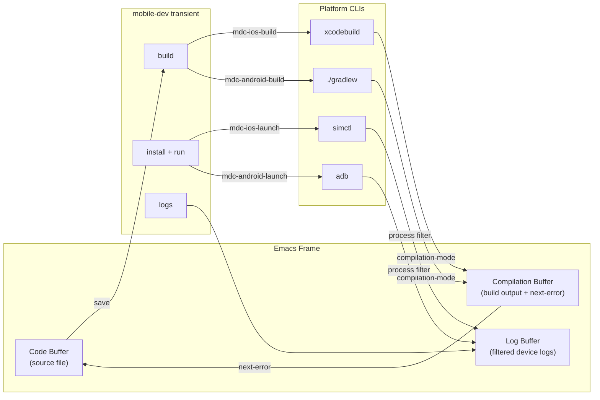
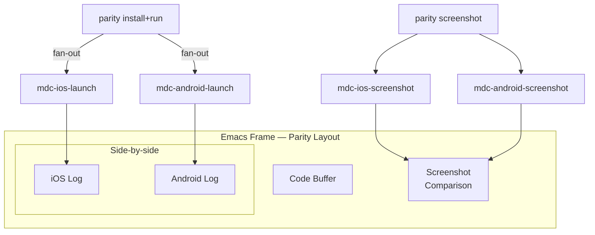
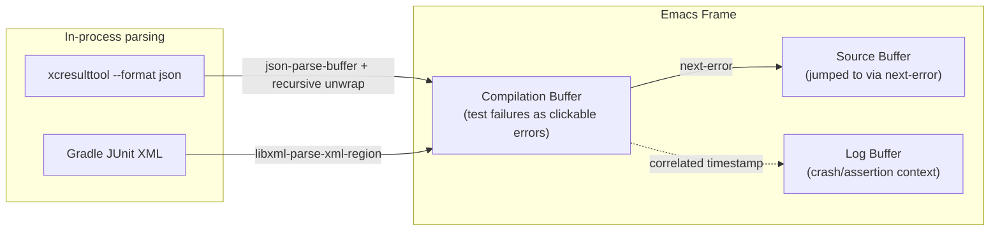
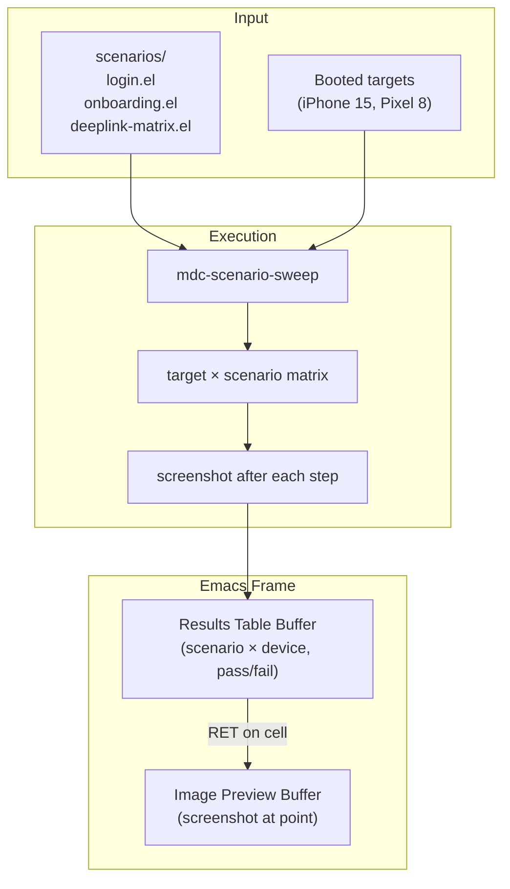

# Mobile Dev Cockpit — Design Notes

An Emacs-native command and automation layer for iOS, Android, and Kotlin Multiplatform workflows. Transient menus over the platform CLIs, with higher-level utilities composed from those primitives.

## Motivation

Mobile dev is the domain where Unix + Emacs ergonomics most obviously fall off. The tools *are* CLI-reachable — `xcodebuild`, `simctl`, `devicectl`, `xcresulttool`, `xctrace`, `adb`, `./gradlew`, `emulator` — but the ceremony is hostile:

- UDIDs and bundle IDs grepped out of JSON blobs on every invocation
- Per-platform flag soup, with no shared vocabulary between iOS and Android
- Build output that doesn't integrate with `compilation-mode` / `next-error`
- Test results locked in `xcresult` bundles and Gradle XML
- Repro state (deep links, locale, push payloads, launch args) set up by clicking through simulator menus every time
- Nothing fans out across platforms — "install and run on every booted target" is a 6-command recipe

The existing answer is to live in Xcode/Android Studio for the mobile loop and accept the context switch. That works, but it fragments the dev environment for projects (especially KMP) where most of the code is platform-neutral and would otherwise be a normal Emacs project.

## Non-Goals (v1)

- Not replacing **storyboard / XIB editors**. The XML is too large and visual to be human-editable in any useful way. (SwiftUI projects sidestep this entirely.)
- Not a build system. `xcodebuild`, `gradle`, and Amper stay authoritative; this sits on top.
- Not cross-platform in the "one binary for Linux/Mac" sense. macOS-first, because that's where the iOS tooling lives.
- Not a new DSL or config language. Project defaults live in `.dir-locals.el`.

### Future goals (deferred, not dismissed)

The following were originally listed as non-goals but are feasible Emacs surfaces. Each is a candidate for a later phase or a companion project:

- **View debugger.** The data is a frame/constraint/layer hierarchy. `simctl` exposes the accessibility tree; `xcrun accessibility` and private APIs can dump more. A `magit-section` or `hierarchy.el` tree buffer with property inspection at point would be searchable, diffable, and scriptable — advantages the Xcode 3D view doesn't have.
- **Memory graph.** CLI tools (`leaks --outputGraph`, `heap`, `vmmap`, `malloc_history`) produce the underlying data. Parsing retain-cycle graphs into a Graphviz-rendered image buffer or navigable tree is a real project but not impossible.
- **Instruments viewer.** Recording is already CLI (`xctrace record`); the doc covers this as "decoupled profiling." Viewing is the gap. `xctrace export` dumps to XML — parsing time profiles into flamegraph SVGs (rendered inline) or a tree buffer is plausible.
- **`.xcassets` browser.** Asset catalogs are directories of JSON manifests + image files. A dired-like listing with inline image previews and variant management is straightforward.
- **`.xcdatamodeld` editor.** Core Data models are XML. A mode presenting entities/attributes/relationships in a table or tree buffer, with editing, is feasible — comparable complexity to what `forge` does for GitHub data.

## Design Principles

1. **Menu as API.** Every action is a transient entry first. Automations are compositions of menu actions, not separate one-off scripts. This makes the tool discoverable and makes utilities trivial to add.
2. **Thin wrappers.** Each leaf calls a platform CLI via `make-process` / `call-process` and routes output to a buffer. No re-implementations of what the platform CLIs already do.
3. **Unified vocabulary across platforms.** Same verbs (`install`, `run`, `stop`, `logs`, `screenshot`, `deep-link`, `clear-data`) map to whichever platform CLI is correct for the current context. Memorize one menu, not two toolchains.
4. **Emacs-native output.** Build output flows through `compilation-mode` with regexes for `xcodebuild` and `gradle`. Test failures flow through it too, via `xcresulttool --format json` and Gradle XML parsing. Logs are buffers you live in, not terminal windows.
5. **Reproducibility over convenience.** Scenario setup (deep links, locale, push payloads, launch args) lives as versioned files in the repo. Clicking through the simulator is never the canonical path.
6. **Pure Elisp, single package.** No external adapter binaries. The adapter layer is Elisp functions calling platform CLIs directly and parsing their output in-process. This eliminates IPC overhead, avoids state duplication (Emacs already holds project context from `.dir-locals.el`), and keeps the package to one language, one test framework, one build tool. If parsing performance becomes an issue for large datasets (e.g., massive xcresult bundles), `async.el` can offload to a child Emacs process — but `json-parse-buffer` is C-native and handles multi-MB JSON in milliseconds, so this is unlikely in practice. CI needs are simple enough (`xcodebuild ...`, `./gradlew ...`) that shell one-liners in a Makefile suffice.

## Architecture

### Three layers (all Elisp)

**1. Platform adapters (`mdc-ios.el`, `mdc-android.el`)**
Elisp functions wrapping the platform CLIs into a common vocabulary:
- `mdc-ios-install`, `mdc-ios-launch`, `mdc-ios-logs`, `mdc-ios-deep-link`, `mdc-ios-screenshot`, `mdc-ios-clear-data`, etc.
- Matching `mdc-android-*` surface over `adb` + `emulator` + `gradle`.
- A dispatcher (`mdc-dispatch`) that picks the right adapter based on current project / selected target.

Each function calls the underlying CLI via `call-process` (synchronous, for quick commands) or `make-process` (async, for builds and log streaming), and parses stdout in-process. JSON parsing uses Emacs's C-native `json-parse-buffer`; XML uses `libxml-parse-xml-region`. No external programs beyond the platform CLIs themselves.

Emacs already holds the project context (bundle ID, scheme, flavor, selected device) via `.dir-locals.el` and buffer-local variables — no state to pass across process boundaries.

**2. Transient menu layer (`mdc-transient.el`)**
A `magit`-shaped menu tree:
- Root (`mobile-dev`) with platform branches (`ios`, `android`), cross-platform actions (`parity`, `scenario`, `profile`, `devices`), and project-level actions (`build`, `test`, `clean`).
- Each leaf calls an adapter function directly (no shelling out to an intermediate binary), routing output to `compilation-mode` or a dedicated buffer.
- Per-project defaults (scheme, simulator, flavor, device) resolved from `.dir-locals.el`.

**3. Compositions (`mdc-compose.el`)**
Higher-level utilities composed from layers 1 and 2. Each is independently small:
- **Parity / fan-out.** One keybind installs + launches on every booted target (iOS sim, Android emulator, physical device) for visual side-by-side regressions.
- **Scenario sweeps.** A list of deep links / locales / themes in a repo file; utility walks through them, screenshots each, dumps to a dated folder.
- **State bookmarking.** Snapshot the simulator's data container (`simctl get_app_container`) + a tag + the current log view. Restore later. Tar+untar under a nice transient face.
- **Compilation integration.** Error regexes for `xcodebuild` and `gradle` output so `next-error` jumps work. `xcresult` → compilation buffer so test failures are clickable.
- **Flaky test triage.** Rerun last-failed tests N times via `xcodebuild test-without-building -only-testing:` or the Gradle equivalent; report pass rate; isolate flakes.
- **Build diff.** Archive two branches, diff app size / method count / Info.plist / declared permissions / embedded frameworks.
- **Log bookmarks.** Tag points in the log stream; filtered views saved as replayable buffers. Halfway between shell history and scratch files.
- **Decoupled profiling.** `profile <scenario>` starts `xctrace` recording, runs the scenario, saves the `.trace`, opens Instruments only at the end as a viewer.

### Why Emacs (and transient specifically)

- `transient.el` is battle-tested for exactly this shape: discoverable, composable menus over a large command surface. Magit proves the pattern scales.
- `compilation-mode`, `comint`, and `vterm` already solve the output ergonomics.
- `.dir-locals.el` solves per-project configuration without a new config format.
- Every utility added gets a keybind and menu entry for free — discoverability scales with the tool surface, opposite of accumulating shell aliases nobody remembers.

### What stays out of Emacs (for now)

- **Storyboard / XIB editing** — the one genuinely irreducible GUI surface. Opened via `open`, which routes to Xcode.
- **Instruments as a viewer** — launched only to read `.trace` files produced by CLI profiling runs. (Viewer replacement is a future goal via `xctrace export` → flamegraph / tree buffer.)
- See "Future goals" in Non-Goals for surfaces that are deferred, not dismissed.

## Command Surface (first pass)

Cross-platform verbs the menu exposes uniformly:

- `devices` — list booted / connected targets across platforms
- `build` — build for current target, current flavor/scheme
- `install` / `uninstall` — push/remove the built app
- `run` / `stop` — launch / kill
- `logs` — streaming log filtered to bundle ID, in a buffer
- `test` — run tests, results routed through compilation-mode
- `screenshot` / `record` — capture device/sim output
- `deep-link <url>` — route a URL through the running app
- `clear-data` — wipe app state without uninstalling
- `push <payload>` — simulate a push notification (iOS: simctl; Android: adb shell am broadcast)
- `shell` — drop into the appropriate CLI context (`lldb` attached / `adb shell`)

Cross-platform compositions:

- `parity <verb>` — apply verb to every booted target
- `scenario <file>` — replay a recorded scenario
- `bookmark` / `restore <tag>` — state snapshots
- `profile <scenario>` — xctrace / systrace wrapper
- `diff <branch-a> <branch-b>` — build-artifact diff

## Phased Path

**Phase 0 — Adapter functions + basic transient**
Elisp adapter functions for `mdc-ios-*` and `mdc-android-*` covering the core verbs (build, install, run, logs, deep-link, screenshot, clear-data). Root transient menu wiring these up. `.dir-locals.el` integration for per-project defaults. Output routed through `compilation-mode` with regexes for `xcodebuild` and `gradle`. Since there's no separate shell layer to validate first, the adapter vocabulary and the menu ship together — the transient *is* the API.

**Phase 1 — xcresult / Gradle test integration**
`xcresulttool --format json` parsed in Elisp → compilation buffer. Gradle JUnit XML parsed via `libxml-parse-xml-region` → compilation buffer. `next-error` jumps to failing test sources.

**Phase 2 — Cross-platform compositions**
`parity`, `scenario`, `bookmark`. These are the payoff — they exist only because the adapters speak a common vocabulary.

**Phase 3 — Higher-level utils**
Flaky test triage, build diff, log bookmarks, decoupled profiling. Each is independently useful; none commits to the next.

Each phase is independently useful. The project is worthwhile even if it stops at Phase 0.

## Resolved Decisions

- **Shell vs Elisp boundary.** Resolved: pure Elisp. No external adapter binaries. The adapter functions call platform CLIs directly via `call-process` / `make-process` and parse output in-process. CI needs are thin enough for shell one-liners in a Makefile. Rationale: eliminates IPC, avoids state duplication (Emacs holds project context), one language / one test framework / one build tool. If parsing ever becomes a bottleneck, `async.el` offloads to a child Emacs.

## Open Questions

- **Scenario file format.** Plain Elisp forms (flexible, no new format) vs a declarative file (easier to read, compose, and diff). Leaning Elisp forms for v0; revisit if scenarios start repeating structure.
- **Target selection UX.** When multiple simulators/devices are booted, how does "the current target" get picked? Default to "most recently used" with an easy override, probably via `completing-read` over parsed `simctl list --json` / `adb devices` output.
- **KMP-specific shape.** Does a KMP project get a unified `test` that runs shared-module tests across both platforms and correlates results? Or keep platforms separate and let the user fan out via `parity`?
- **Physical device ergonomics.** `devicectl` is newer and less documented than `simctl`. How much of the iOS menu works on real devices in Phase 0 vs sim-only?
- **Project detection.** Heuristic (presence of `*.xcodeproj`, `build.gradle.kts`, `shared/` module) vs explicit declaration in `.dir-locals.el`. Probably both — heuristic with override.
- **Package structure.** Single `mdc.el` vs split files (`mdc-ios.el`, `mdc-android.el`, `mdc-transient.el`, `mdc-compose.el`). Leaning split — each file is independently loadable and testable.

## Workflow Diagrams

### Edit → Build → Run loop

The primary workflow. Three buffers + transient as the command palette.

### Cross-platform parity check

Fan-out across all booted targets. The spatial layout *is* the feature — side-by-side logs and screenshots.

### Test failure triage

Compilation buffer with `next-error` jumping to source + correlated log output.

### Scenario sweep / visual regression

Table of results across scenario × device. Dashboard-shaped — closer to a report than an editing layout.

## Prior Art Worth Studying

- [Magit](https://github.com/magit/magit) — the canonical example of transient-over-CLI done well
- [transient.el](https://github.com/magit/transient) — the menu library itself
- [android-mode](https://codeberg.org/rwv/android-mode) — prior Emacs Android integration (dormant since 2014, wraps obsolete `ant`/`ddms`; worth reading for Elisp patterns around SDK path resolution and process invocation, but the tooling it targets is dead)
- [xctool](https://github.com/facebookarchive/xctool) — earlier attempt at smoothing `xcodebuild`
- [fastlane](https://fastlane.tools/) — covers distribution/signing automation; overlapping surface but different shape (Ruby DSL, monolithic)
- [xcbeautify](https://github.com/cpisciotta/xcbeautify) — output formatter, usable as-is inside compilation-mode
- [Maestro](https://maestro.mobile.dev/) — UI test scenario replay; conceptually close to scenario sweeps
- [idb](https://github.com/facebook/idb) — Facebook's cross-device iOS CLI; worth mining for adapter vocabulary

## Status

Design phase. No code written. Key decisions resolved:
- Pure Elisp — no external adapter binaries
- Non-goals revised — GUI surfaces are deferred future goals, not permanent exclusions (except storyboards)
- Workflow-oriented thinking via mermaid diagrams to drive ergonomic decisions

Next: finalize package structure, scaffold the repo (Cask/Eask, test framework, file layout), then begin Phase 0.
